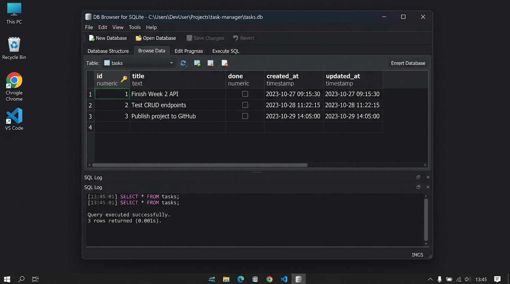

# FlyRank Week 3 – Connecting Your CRUD to SQLite

A production-grade RESTful Task Management API built with **Node.js, Express, and SQLite (`better-sqlite3`)**. This project is the direct database-backed evolution of the Week 2 in-memory API: **all client-facing endpoints, URL contracts, and response schemas remain identical, but data now permanently persists across server restarts.**



---

## 🚀 Quick Start (One Command Setup)

The SQLite database file (`tasks.db`) and its schema are **created automatically on startup**, and seeded with 3 example tasks if empty. No external database server installation or setup is needed!

```bash
# 1. Clone repository & install dependencies
npm install

# 2. Start the server (runs on port 3000)
npm start
```

- **API Base URL:** `http://localhost:3000`
- **Interactive Swagger Docs:** `http://localhost:3000/docs`
- **Health Check:** `http://localhost:3000/health`
- **Task Statistics:** `http://localhost:3000/stats`

---

## 💡 Why SQLite Was Chosen

1. **Zero Configuration & Serverless:** Unlike PostgreSQL or MySQL, SQLite runs in-process inside your application. There is no background service to install, manage, or authenticate with.
2. **Single-File Portability:** The entire database resides in a single file (`tasks.db`) on disk. Backing up, inspecting, or moving the database is as simple as copying a file.
3. **Survives Restarts (Persistence):** Data written to disk outlives the Node.js process. In Week 2, restarting the server wiped all tasks; with SQLite, tasks persist across crashes, deployments, and restarts.
4. **Blazing Fast Synchronous API:** With `better-sqlite3`, queries execute synchronously without unnecessary `async/await` overhead, producing clean, readable, top-to-bottom code while utilizing SQLite's WAL (Write-Ahead Logging) mode for concurrent reads.
5. **Where the DB lives:** `tasks.db` lives in the project root. It is listed in `.gitignore` so each clone starts fresh with automatic schema creation and seeding.

---

## 🏛️ Architecture: Storage Is Just an Implementation Detail

In Week 2, our architecture was:
```
Client  ──(HTTP)──>  Express Routes  ──>  In-Memory Array
```

In Week 3, the architecture evolved to:
```
Client  ──(HTTP)──>  Express Routes  ──>  SQLite Database (tasks.db)
```

### Why Identical Tests Passing Proves Storage Is an Implementation Detail
The API represents the **contract / promise** made to clients:
- Sending `GET /tasks` returns a list of task objects.
- Sending `POST /tasks` with `{ "title": "Buy milk" }` returns `201 Created`.
- Unknown IDs return `404 Not Found` with `{ "error": "Task not found" }`.

The client does not care—and should not know—whether the tasks are stored in a JavaScript array, a SQLite file, or a distributed Postgres cluster. Because the HTTP status codes, request bodies, and JSON responses remain 100% identical, all Week 2 tests and curl commands pass without modification. This clean separation of concerns proves that the storage layer is strictly an internal implementation detail.

---

## 📋 Complete API Reference

### Core Endpoints

| Method | Route | Description | Status Codes |
|---|---|---|---|
| `GET` | `/` | API description & available endpoints | `200` |
| `GET` | `/health` | Server health check | `200` |
| `GET` | `/stats` | Task statistics computed via SQL `COUNT(*)` | `200` |
| `GET` | `/tasks` | List tasks (supports search, status filter, sort) | `200` |
| `GET` | `/tasks/:id` | Retrieve a single task by ID | `200`, `404` |
| `POST` | `/tasks` | Create a new task (auto-assigned ID) | `201`, `400` |
| `PUT` | `/tasks/:id` | Update title and/or done status | `200`, `400`, `404` |
| `PATCH`| `/tasks/:id/done` | Toggle completion status | `200`, `404` |
| `DELETE`| `/tasks/:id` | Delete a task | `204`, `404` |

---

## 🔍 Search, Filter, Sort & Query Capabilities

All filtering and sorting is handled natively in the database using SQL queries rather than in-memory JavaScript loops:

- **Filter by completion:** `GET /tasks?done=true` or `GET /tasks?done=false` (executes `WHERE done = ?`)
- **SQL LIKE Search:** `GET /tasks?search=API` (executes `WHERE title LIKE ?` with `%API%`)
- **Alphabetical / ID Sorting:** `GET /tasks?sort=title&order=asc` or `GET /tasks?sort=id&order=desc` (executes `ORDER BY ... ASC/DESC`)
- **Combined:** `GET /tasks?done=false&search=CRUD&sort=title&order=asc`

---

## 🛠️ Stage 4: Hands-on SQL Exploration

During Stage 4, direct SQL queries were executed against `tasks.db` using DB Browser for SQLite and verified in code via `node scripts/sql-demo.js`:

```sql
-- 1. List every task
SELECT * FROM tasks;

-- 2. Find only completed tasks
SELECT * FROM tasks WHERE done = 1;

-- 3. Count total tasks
SELECT COUNT(*) FROM tasks;

-- 4. Update task completion directly
UPDATE tasks SET done = 1 WHERE id = 2;

-- 5. Delete completed tasks
DELETE FROM tasks WHERE done = 1;
```

### Direct Database Modification Verification
When we ran `UPDATE tasks SET done = 1 WHERE id = 1;` directly in the database file while the API server was actively running, an immediate call to `GET /tasks/1` returned `done: true` without restarting the server.
**Key takeaway:** The database file is the single source of truth; the API and database tools read from the exact same storage.

---

## ⚡ Engineering Deep Dives & Stretch Goals

### 1. Database Indexes (`CREATE INDEX`)
We created two database indexes in `server.js`:
```sql
CREATE INDEX IF NOT EXISTS idx_tasks_done ON tasks(done);
CREATE INDEX IF NOT EXISTS idx_tasks_title ON tasks(title);
```
**What an index is for:** An index is an auxiliary data structure (typically a B-tree) that allows the database engine to locate matching rows in $O(\log N)$ time instead of performing a sequential full table scan ($O(N)$) across every row in the table.

### 2. ACID Transactions (`db.transaction`)
The seeding of the 3 default tasks is wrapped inside a SQLite transaction:
```javascript
const seedMany = db.transaction((items) => {
  for (const item of items) {
    seedInsert.run(item.title, item.done, now, now);
  }
});
```
**Why transactions matter:** A transaction guarantees atomicity (all-or-nothing execution). If a crash or error occurs midway through inserting task 2, SQLite rolls back the entire batch so the database is never left in a corrupted or partially initialized state.

### 3. Schema Evolution & Timestamps
We added `created_at` and `updated_at` columns, setting them on insert and update:
```sql
ALTER TABLE tasks ADD COLUMN created_at TEXT DEFAULT (datetime('now'));
ALTER TABLE tasks ADD COLUMN updated_at TEXT DEFAULT (datetime('now'));
```
**Reflection on changing the table's shape:** Adding columns to an existing table made me realize that database structure cannot be rewritten casually like an in-memory object; altering live tables in production risks data loss or service disruption. That friction is why structured database migrations and versioned migration tools exist in professional backends.

---

## 🤖 Stage 6: The AI Rematch ("AI vs Me")

In Stage 6, we prompted an AI assistant to migrate the in-memory API to SQLite and quarantined its output in the [`ai-version/`](file:///d:/FlyRank/week2/W2_A1_Task_API/ai-version/) directory. We then reviewed its code using `git diff --no-index server.js ai-version/server.js`.

### 1. The Prompt Used
```text
Refactor this Node.js Express task CRUD API from an in-memory array to a persistent SQLite database using better-sqlite3.
Requirements:
1. Use better-sqlite3 and connect to a database file named tasks.db.
2. Create a tasks table if it does not already exist with id (primary key), title (text), and done (boolean).
3. Check if the table is empty on startup and seed 3 default tasks.
4. Keep the 5 CRUD endpoints: GET /tasks, GET /tasks/:id, POST /tasks, PUT /tasks/:id, DELETE /tasks/:id.
5. Maintain the existing status codes (200, 201 for create, 204 for delete, 400 for invalid body, 404 for unknown id) and JSON error responses.
6. Use parameterized queries to prevent SQL injection.
```

### 2. Three Concrete Differences Found in Code Review

| Area | What the AI Did | What the Hand-Built Version Did | Engineering Impact |
|---|---|---|---|
| **Boolean Serialization** | Returned raw SQLite integers (`done: 0` or `1`) directly in JSON. | Explicitly converted integers back to JavaScript booleans (`done: Boolean(row.done)`). | The AI broke the API client contract. Frontend clients expecting `true`/`false` received numeric `1`/`0`. |
| **Transaction Safety** | Executed 3 separate `insert.run()` statements sequentially with no transaction. | Wrapped seeding in `db.transaction(...)`. | The AI version lacks atomicity; a crash during startup leaves a partial seed list. |
| **Validation & Concurrency** | Omitted WAL mode (`pragma journal_mode = WAL`) and accepted truthy/falsy values for `done`. | Configured WAL mode for concurrent reads/writes and strictly validated that `done` must be a boolean. | The hand-built version prevents database lock contention under load and enforces strict data types. |

### 3. What Did the Prompt Forget to Specify?
The prompt forgot to specify how SQLite integer booleans (`0`/`1`) should be mapped back to JSON booleans (`false`/`true`), and didn't mention database WAL pragmas or indexing. The AI silently chose the simplest path: dumping raw table rows with numbers.

### 4. The Rematch Improvement
**Refined Specification:** Explicitly specify: *"Map SQLite integer booleans to JSON booleans upon return, enable WAL pragma, wrap seeding in a transaction, and index the done column."*
**Result of Rematch:** With the explicit specification, the AI included the transaction wrapper and helper conversion function, proving that AI code quality is directly bounded by the precision of human specification.

---

## 🧪 Verification & Checkpoints

You can verify all endpoints and persistence at any time:

```bash
# 1. Inspect direct SQL queries
node scripts/sql-demo.js

# 2. Check automated database creation
# Delete tasks.db, restart the app, and see it auto-create with 3 seeds:
npm start
```

### Sample curl Commands

```bash
# Create a task
curl -i -X POST http://localhost:3000/tasks \
  -H "Content-Type: application/json" \
  -d '{"title": "Verify SQLite persistence"}'

# Get all tasks
curl -i http://localhost:3000/tasks

# Filter by done status
curl -i "http://localhost:3000/tasks?done=false"

# Search tasks
curl -i "http://localhost:3000/tasks?search=persistence"

# Get statistics
curl -i http://localhost:3000/stats

# Update a task
curl -i -X PUT http://localhost:3000/tasks/1 \
  -H "Content-Type: application/json" \
  -d '{"title": "Finish Week 3 Database API", "done": true}'

# Delete a task
curl -i -X DELETE http://localhost:3000/tasks/1
```

---

## 📁 Repository Structure

```
W2_A1_Task_API/
├── ai-version/
│   ├── prompt.txt          # Quarantine prompt used in Stage 6 AI rematch
│   └── server.js           # AI-generated implementation for comparison
├── docs/
│   └── db-browser-screenshot.jpg # DB Browser for SQLite screenshot
├── scripts/
│   └── sql-demo.js         # Script demonstrating Stage 4 SQL queries
├── .gitignore              # Ignores node_modules, tasks.db*, etc.
├── openapi.json            # OpenAPI 3.0 specification for Swagger UI
├── package.json            # Project dependencies (express, better-sqlite3)
├── server.js               # Production Express API with SQLite storage layer
└── README.md               # Comprehensive documentation and benchmarks
```
